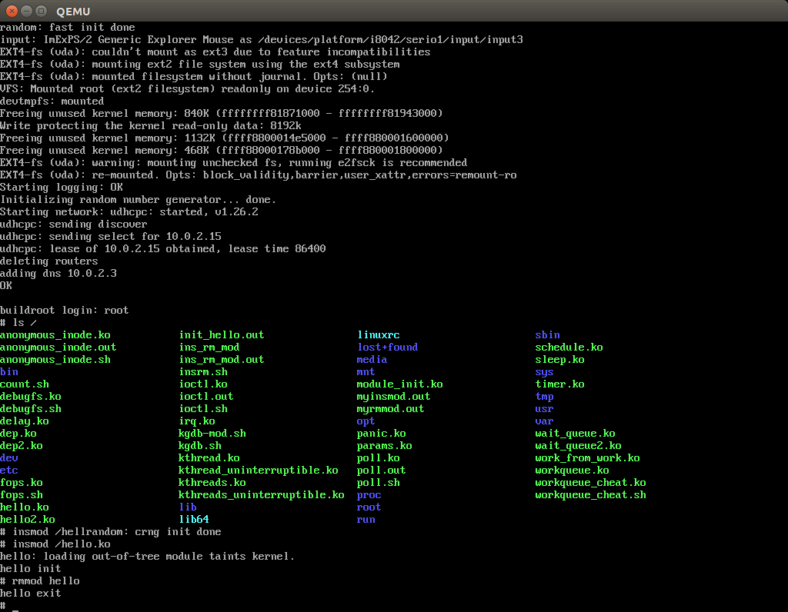
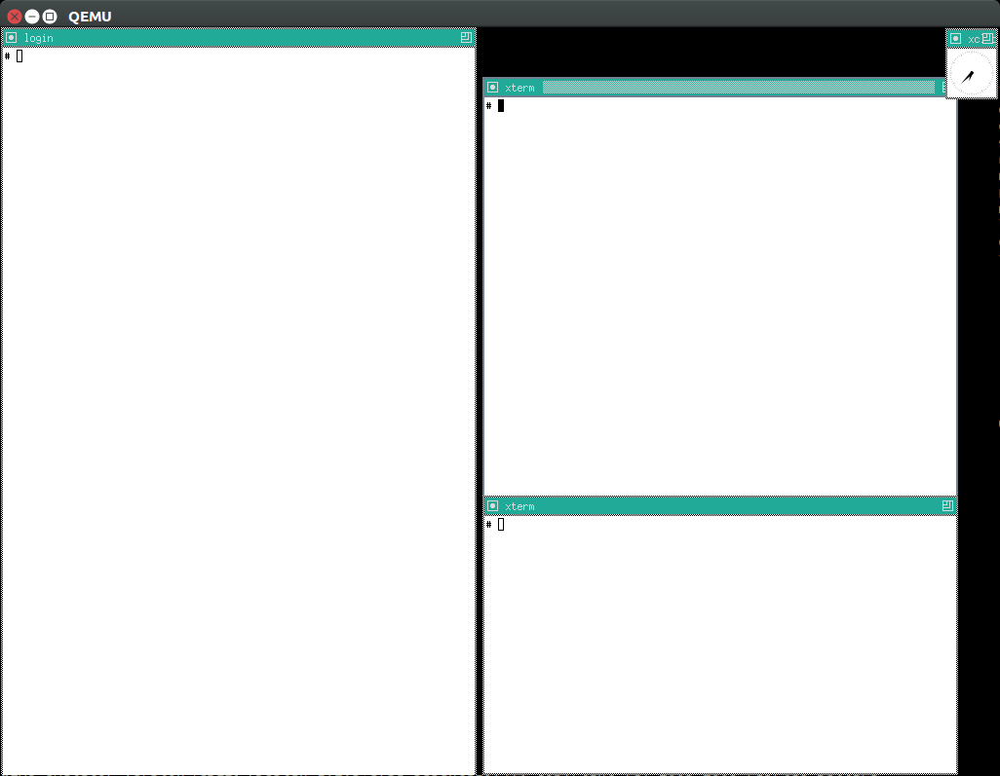

= Linux Kernel Module Cheat
:idprefix:
:idseparator: -
:sectanchors:
:sectlinks:
:sectnumlevels: 6
:sectnums:
:toc: macro
:toclevels: 6
:toc-title:

Run one command, get a QEMU Buildroot BusyBox virtual machine built from source with several minimal Linux kernel 4.15 module development example tutorials with GDB and KGDB step debugging and minimal educational hardware models. Limited GEM5 full system support. "Tested" in x86, ARM and MIPS guests, Ubuntu 17.10 host.

toc::[]

== Action

=== Getting started

Reserve 12Gb of disk and run:

....
git clone https://github.com/cirosantilli/linux-kernel-module-cheat
cd linux-kernel-module-cheat
./configure && ./build && ./run
....

The first build will take a while (https://stackoverflow.com/questions/10833672/buildroot-environment-with-host-toolchain[GCC], Linux kernel), e.g.:

* 2 hours on a mid end 2012 laptop
* 30 minutes on a high end 2017 desktop

If you don't want to wait, you could also try to compile the examples and run them on your host computer as explained on the link:run-on-host.md["Run on host" section], but as explained on that section, that is dangerous, limited, and will likely not work.

After QEMU opens up, you can start playing with the kernel modules:

....
root
insmod /hello.ko
insmod /hello2.ko
rmmod hello
rmmod hello2
....

This should print to the screen:

....
hello init
hello2 init
hello cleanup
hello2 cleanup
....

which are `printk` messages from `init` and `cleanup` methods of those modules.

All available modules can be found in the link:kernel_module/[`kernel_module` directory].

==== Module documentation

....
head kernel_module/modulename.c
....

Many of the modules have userland test scripts / executables with the same name as the module, e.g. form inside the guest:

....
/modulename.sh
/modulename.out
....

The sources of those tests will further clarify what the corresponding kernel modules does. To find them on the host, do a quick:

....
git ls-files | grep modulename
....

==== Rebuild

If you make changes to the kernel modules or most configurations tracked on this repository, you can just use again:

....
./build
./run
....

and the modified files will be rebuilt.

If you change any package besides `kernel_module`, you must also request those packages to be reconfigured or rebuilt with extra targets, e.g.:

....
./build -t linux-reconfigure -t host-qemu-reconfigure
....

Those aren't turned on by default because they take quite a few seconds.

Linux and QEMU rebuilds are so common that we have dedicated shortcut flags for them:

....
./build -l -q
....

==== Clean the build

You did something crazy, and nothing seems to work anymore?

All builds are stored under `buildroot/`,

The most coarse thing you can do is:

....
cd buildroot
git checkout -- .
git clean -xdf .
....

To only nuke one architecture, do:

....
rm -rf buildroot/output.x86_64~
....

Only nuke one one package:

....
rm -rf buildroot/output.x86_64~/build/host-qemu-custom
./build -q
....

This is sometimes necessary when changing the version of the submodules, and then builds fail. We should try to understand why and report bugs.

==== Filesystem persistency

The root filesystem is persistent across:

....
./run
date >f
sync
poweroff
....

then:

....
./run
cat f
....

This is particularly useful to re-run shell commands from the history of a previous session with `Ctrl + R`.

However, when you do:

....
./build
....

the disk image gets overwritten by a fresh filesystem and you lose all changes.

Remember that if you forcibly turn QEMU off without `sync` or `poweroff` from inside the VM, e.g. by closing the QEMU window, disk changes may not be saved.

==== Message control

We use `printk` a lot, and it shows on the QEMU terminal by default. If that annoys you (e.g. you want to see stdout separately), do:

....
dmesg -n 1
....

See also: https://superuser.com/questions/351387/how-to-stop-kernel-messages-from-flooding-my-console

You can scroll up a bit on the default TTY with:

....
Shift + PgUp
....

but I never managed to increase that buffer:

* https://askubuntu.com/questions/709697/how-to-increase-scrollback-lines-in-ubuntu14-04-2-server-edition
* https://unix.stackexchange.com/questions/346018/how-to-increase-the-scrollback-buffer-size-for-tty

The superior alternative is to use text mode or a telnet connection.

==== Text mode

Show serial console directly on the current terminal, without opening a QEMU window:

....
./run -n
....

To exit, just do a regular:

....
poweroff
....

This mode is very useful to:

* get full panic traces when you start making the kernel crash :-) See also: https://unix.stackexchange.com/questions/208260/how-to-scroll-up-after-a-kernel-panic
* copy and paste commands and stdout output to / from host
* have a large scroll buffer, and be able to search it, e.g. by using GNU `screen` on host

If the system crashes and you can't can quit QEMU with `poweroff`, or if `poweroff` is just too slow for your patience, you can hard kill the VM with

....
Ctrl-C X
....

or:

....
Ctrl-C A
quit
....

or on host:

....
./qemumonitor
quit
....

or:

....
echo quit | ./qemumonitor
....

See also:

* http://stackoverflow.com/questions/14165158/how-to-switch-to-qemu-monitor-console-when-running-with-curses
* https://superuser.com/questions/1087859/how-to-quit-qemu-monitor
* https://superuser.com/questions/488263/problems-switching-to-qemu-control-panel-with-nographics
* https://superuser.com/questions/1087859/how-to-quit-the-qemu-monitor-when-not-using-a-gui/1211516#1211516

Limitations:

* TODO: Ctrl + C kills the emulator for some setups (TODO which what exactly?), and not sent to guest processes. See:
** https://github.com/cloudius-systems/osv/issues/49
** https://unix.stackexchange.com/questions/167165/how-to-pass-ctrl-c-in-qemu
+
This is however fortunate when running QEMU with GDB, as the Ctrl + C reaches GDB and breaks.
* Very early kernel messages such as `early console in extract_kernel` only show on the GUI, since at such early stages, not even the serial has been setup.

==== Automatic startup commands

When debugging a module, it becomes tedious to wait for build and re-type:

....
root
/modulename.sh
....

every time.

Instead, you can either run them from a minimal init:

....
./run -e 'init=/eval.sh - lkmc_eval="insmod /hello.ko;/poweroff.out"' -n
....

or run them at the end of the BusyBox init, which does things like setting up networking:

....
./run -e '- lkmc_eval="insmod /hello.ko;wget -S google.com;poweroff.out;"'
....

or add them to a new `init.d` entry:

....
cp rootfs_overlay/etc/init.d/S98 rootfs_overlay/etc/init.d/S99
vim S99
./build
./run
....

and they will be run automatically before the login prompt.

`S99` is a git tracked convenience symlink to the gitignored `rootfs_overlay/etc/init.d/S99`

Scripts under `/etc/init.d` are run by `/etc/init.d/rcS`, which gets called by the line `::sysinit:/etc/init.d/rcS` in `/etc/inittab`.

==== Kernel version

We try to use the latest possible kernel major release version.

In QEMU:

....
cat /proc/version
....

or in the source:

....
cd linux
git log | grep -E '    Linux [0-9]+\.' | head
....

Build configuration can be observed in guest with:

....
zcat /proc/config.gz
....

or on host:

....
cat buildroot/output.*~/build/linux-custom/.config
....

==== Kernel boot command line arguments

Bootloaders can pass a string as input to the Linux kernel when it is booting to control its behaviour, much like the `execve` system call does to userland processes.

This allows us to control the behaviour of the kernel without rebuilding anything.

With QEMU, QEMU itself acts as the bootloader, and provides the `-append` option and we expose it through `./run -e`, e.g.:

....
./run -e 'foo bar'
....

Then inside the host, you can check which options were given with:

....
cat /proc/cmdline
....

They are also printed at the beginning of the boot message:

....
dmesg | grep "Command line"
....

See also:

* https://unix.stackexchange.com/questions/48601/how-to-display-the-linux-kernel-command-line-parameters-given-for-the-current-bo
* https://askubuntu.com/questions/32654/how-do-i-find-the-boot-parameters-used-by-the-running-kernel

The arguments are documented in the kernel documentation: https://www.kernel.org/doc/html/v4.14/admin-guide/kernel-parameters.html

When dealing with real boards, extra command line options are provided on some magic bootloader configuration file, e.g.:

* GRUB configuration files: https://askubuntu.com/questions/19486/how-do-i-add-a-kernel-boot-parameter
* Raspberry pi `/boot/cmdline.txt` on a magic partition: https://raspberrypi.stackexchange.com/questions/14839/how-to-change-the-kernel-commandline-for-archlinuxarm-on-raspberry-pi-effectly

==== QEMU GUI is unresponsive

Sometimes in Ubuntu 14.04, after the QEMU SDL GUI starts, it does not get updated after keyboard strokes, and there are artifacts like disappearing text.

We have not managed to track this problem down yet, but the following workaround always works:

....
Ctrl + Shift + U
Ctrl + C
root
....

This started happening when we switched to building QEMU through Buildroot, and has not been observed on later Ubuntu.

Using text mode is another workaround if you don't need GUI features.

==== Debug QEMU

When you start interacting with QEMU hardware, it is useful to see what is going on inside of QEMU itself.

This is of course trivial since QEMU is just an userland program on the host, but we make it a bit easier with:

....
./run -q
....

Then you could:

....
b edu_mmio_read
c
....

And in QEMU:

....
/pci.sh
....

Just make sure that you never click inside the QEMU window when doing that, otherwise you mouse gets captured forever, and the only solution I can find is to go to a TTY with Ctrl + Alt + F1 and `kill` QEMU.

You can still send key presses to QEMU however even without the mouse capture, just either click on the title bar, or alt tab to give it focus.

[[gdb]]
=== GDB step debugging

To GDB step debug the Linux kernel, first run:

....
./run -d
....

If you want to break immediately at a symbol, e.g. `start_kernel` of the boot sequence, run on another shell:

....
./rungdb start_kernel
....

Now QEMU will stop there, and you can use the normal GDB commands:

....
l
n
c
....

To skip the boot, run just:

....
./rungdb
....

and when you want to break, do `Ctrl + C` from GDB.

To have some fun, you can first run inside QEMU:

....
/count.sh
....

which counts to infinity to stdout, and then in GDB:

....
Ctrl + C
break sys_write
continue
continue
continue
....

And you now control the counting from GDB.

See also:

* http://stackoverflow.com/questions/11408041/how-to-debug-the-linux-kernel-with-gdb-and-qemu/33203642#33203642
* http://stackoverflow.com/questions/4943857/linux-kernel-live-debugging-how-its-done-and-what-tools-are-used/42316607#42316607

`O=0` is an impossible dream, `O=2` being the default: https://stackoverflow.com/questions/29151235/how-to-de-optimize-the-linux-kernel-to-and-compile-it-with-o0 So get ready for some weird jumps, and `<value optimized out>` fun. Why, Linux, why.

==== Kernel module debugging

Loadable kernel modules are a bit trickier since the kernel can place them at different memory locations depending on load order.

So we cannot set the breakpoints before `insmod`.

However, the Linux kernel GDB scripts offer the `lx-symbols` command, which takes care of that beautifully for us:

....
./run -d
./rungdb
....

In QEMU:

....
insmod /fops.ko
....

In GDB, hit `Ctrl + C`, and note how it says:

....
scanning for modules in ../kernel_module-1.0/
loading @0xffffffffa0000000: ../kernel_module-1.0//fops.ko
....

That's `lx-symbols` working! Now simply:

....
b fop_write
c
....

In QEMU:

....
printf a >/sys/kernel/debug/lkmc_fops/f
....

and GDB now breaks at our `fop_write` function!

Just don't forget to remove your breakpoints after `rmmod`, or they will point to stale memory locations.

TODO: why does `break work_func` for `insmod kthread.ko` not break the first time I `insmod`, but breaks the second time?

See also: http://stackoverflow.com/questions/28607538/how-to-debug-linux-kernel-modules-with-qemu/44095831#44095831

===== Bypassing lx-symbols

Useless, but a good way to show how hardcore you are. From inside QEMU:

....
insmod /fops.ko
cat /proc/modules
....

This will give a line of form:

....
fops 2327 0 - Live 0xfffffffa00000000
....

And then tell GDB where the module was loaded with:

....
Ctrl + C
add-symbol-file ../kernel_module-1.0/fops.ko 0xfffffffa00000000
....

==== Debug kernel early boot

TODO: why can't we break at early startup stuff such as:

....
./rungdb extract_kernel
./rungdb main
....

See also: https://stackoverflow.com/questions/2589845/what-are-the-first-operations-that-the-linux-kernel-executes-on-boot

==== GDB call

GDB can call functions as explained at: https://stackoverflow.com/questions/1354731/how-to-evaluate-functions-in-gdb

However this is failing for us:

* some symbols are not visible to `call` even though `b` sees them
* for those that are, `call` fails with an E14 error

E.g.: if we break on `sys_write` on `/count.sh`:

....
>>> call printk(0, "asdf")
Could not fetch register "orig_rax"; remote failure reply 'E14'
>>> b printk
Breakpoint 2 at 0xffffffff81091bca: file kernel/printk/printk.c, line 1824.
>>> call fdget_pos(fd)
No symbol "fdget_pos" in current context.
>>> b fdget_pos
Breakpoint 3 at 0xffffffff811615e3: fdget_pos. (9 locations)
>>>
....

even though `fdget_pos` is the first thing `sys_write` does:

....
581 SYSCALL_DEFINE3(write, unsigned int, fd, const char __user *, buf,
582         size_t, count)
583 {
584     struct fd f = fdget_pos(fd);
....

See also: https://github.com/cirosantilli/linux-kernel-module-cheat/issues/19

=== KGDB

KGDB is kernel dark magic that allows you to GDB the kernel on real hardware without any extra hardware support.

It is useless with QEMU since we already have full system visibility with `-gdb`, but this is a good way to learn it.

Cheaper than JTAG (free) and easier to setup (all you need is serial), but with less visibility as it depends on the kernel working, so e.g.: dies on panic, does not see boot sequence.

Usage:

....
./run -k
./rungdb -k
....

In GDB:

....
c
....

In QEMU:

....
/count.sh &
/kgdb.sh
....

In GDB:

....
b sys_write
c
c
c
c
....

And now you can count from GDB!

If you do: `b sys_write` immediately after `./rungdb -k`, it fails with `KGDB: BP remove failed: <address>`. I think this is because it would break too early on the boot sequence, and KGDB is not yet ready.

See also:

* https://github.com/torvalds/linux/blob/v4.9/Documentation/DocBook/kgdb.tmpl
* https://stackoverflow.com/questions/22004616/qemu-kernel-debugging-with-kgdb/44197715#44197715

==== KGDB kernel modules

In QEMU:

....
/kgdb-mod.sh
....

In GDB:

....
lx-symbols ../kernel_module-1.0/
b fop_write
c
c
c
....

and you now control the count.

TODO: if I `-ex lx-symbols` to the `gdb` command, just like done for QEMU `-gdb`, the kernel oops. How to automate this step?

==== KDB

If you modify `runqemu` to use:

....
-append kgdboc=kbd
....

instead of `kgdboc=ttyS0,115200`, you enter a different debugging mode called KDB.

Usage: in QEMU:

....
[0]kdb> go
....

Boot finishes, then:

....
/kgdb.sh
....

And you are back in KDB. Now you can:

....
[0]kdb> help
[0]kdb> bp sys_write
[0]kdb> go
....

And you will break whenever `sys_write` is hit.

The other KDB commands allow you to instruction steps, view memory, registers and some higher level kernel runtime data.

But TODO I don't think you can see where you are in the kernel source code and line step as from GDB, since the kernel source is not available on guest (ah, if only debugging information supported full source).

=== gdbserver

Step debug userland processes to understand how they are talking to the kernel.

In guest:

....
/gdbserver.sh /myinsmod.out /hello.ko
....

In host:

....
./rungdbserver kernel_module-1.0/user/myinsmod.out
....

You can find the executable with:

....
find buildroot/output.x86_64~/build -name myinsmod.out
....

TODO: automate the path finding:

* using the executable from under `buildroot/output.x86_64~/target` would be easier as the path is the same as in guest, but unfortunately those executables are stripped to make the guest smaller. `BR2_STRIP_none=y` should disable stripping, but make the image way larger.
* `outputx86_64~/staging/` would be even better than `target/` as the docs say that this directory contains binaries before they were stripped. However, only a few binaries are pre-installed there by default, and it seems to be a manual per package thing.
+
E.g. `pciutils` has for `lspci`:
+
....
define PCIUTILS_INSTALL_STAGING_CMDS
    $(TARGET_MAKE_ENV) $(MAKE1) -C $(@D) $(PCIUTILS_MAKE_OPTS) \
        PREFIX=$(STAGING_DIR)/usr SBINDIR=$(STAGING_DIR)/usr/bin \
        install install-lib install-pcilib
endef
....
+
and the docs describe the `*_INSTALL_STAGING` per package config, which is normally set for shared library packages.
+
Feature request: https://bugs.busybox.net/show_bug.cgi?id=10386

An implementation overview can be found at: https://reverseengineering.stackexchange.com/questions/8829/cross-debugging-for-mips-elf-with-qemu-toolchain/16214#16214

==== gdbserver different archs

As usual, different archs work with:

....
./rungdbserver -a arm kernel_module-1.0/user/myinsmod.out
....

==== gdbserver BusyBox

BusyBox executables are all symlinks, so if you do on guest:

....
/gdbserver.sh ls
....

on host you need:

....
./rungdbserver busybox-1.26.2/busybox
....

==== gdbserver shared libraries

Our setup gives you the rare opportunity to step debug libc and other system libraries e.g. with:

....
b open
c
....

Or simply by stepping into calls:

....
s
....

This is made possible by the GDB command:

....
set sysroot ${buildroot_out_dir}/staging
....

which automatically finds unstripped shared libraries on the host for us.

See also: https://stackoverflow.com/questions/8611194/debugging-shared-libraries-with-gdbserver/45252113#45252113

==== Debug userland process without gdbserver

QEMU `-gdb` GDB breakpoints are set on virtual addresses, so you can in theory debug userland processes as well.

* https://stackoverflow.com/questions/26271901/is-it-possible-to-use-gdb-and-qemu-to-debug-linux-user-space-programs-and-kernel
* https://stackoverflow.com/questions/16273614/debug-init-on-qemu-using-gdb

The only use case I can see for this is to debug the init process (and have fun), otherwise, why wouldn't you just use `gdbserver`? Known limitations of direct userland debugging:

* the kernel might switch context to another process, and you would enter "garbage"
* TODO step into shared libraries. If I attempt to load them explicitly:
+
....
(gdb) sharedlibrary ../../staging/lib/libc.so.0
No loaded shared libraries match the pattern `../../staging/lib/libc.so.0'.
....
+
since GDB does not know that libc is loaded.

Custom init process:

* Shell 1:
+
....
./run -d -e 'init=/sleep_forever.out' -n
....
* Shell 2:
+
....
./rungdb-user kernel_module-1.0/user/sleep_forever.out main
....

BusyBox custom init process:

* Shell 1:
+
....
./run -d -e 'init=/bin/ls' -n
....
* Shell 2:
+
....
./rungdb-user -h busybox-1.26.2/busybox ls_main
....

This follows BusyBox' convention of calling the main for each executable as `<exec>_main` since the `busybox` executable has many "mains".

BusyBox default init process:

* Shell 1:
+
....
./run -d -n
....
* Shell 2:
+
....
./rungdb-user -h busybox-1.26.2/busybox init_main
....

This cannot be debugged in another way without modifying the source, or `/sbin/init` exits early with:

....
"must be run as PID 1"
....

Non-init process:

* Shell 1
+
....
./run -d -n
....
* Shell 2
+
....
./rungdb-user kernel_module-1.0/user/sleep_forever.out
Ctrl + C
b main
continue
....
* Shell 1
+
....
/sleep_forever.out
....

This is of least reliable setup as there might be other processes that use the given virtual address.

=== Other architectures

The portability of the kernel and toolchains is amazing: change an option and most things magically work on completely different hardware.

==== arm

First build:

....
./build -a arm
./run -a arm
....

Debug:

....
./run -a arm -d
# On another terminal.
./rungdb -a arm
....

TODOs:

* only managed to run in the terminal interface (but weirdly a blank QEMU window is still opened)
* GDB not connecting to KGDB. Possibly linked to `-serial stdio`. See also: https://stackoverflow.com/questions/14155577/how-to-use-kgdb-on-arm

==== aarch64

....
./build -a aarch64
....

As usual, we use Buildroot's recommended QEMU setup QEMU `aarch64` setup:

* https://github.com/buildroot/buildroot/blob/2017.08/board/qemu/aarch64-virt/readme.txt
* https://github.com/buildroot/buildroot/blob/2017.08/configs/qemu_aarch64_virt_defconfig

This makes aarch64 a bit different from `arm`:

* uses `-M virt`. https://wiki.qemu.org/Documentation/Platforms/ARM explains:
+
____
Most of the machines QEMU supports have annoying limitations (small amount of RAM, no PCI or other hard disk, etc) which are there because that's what the real hardware is like. If you don't care about reproducing the idiosyncrasies of a particular bit of hardware, the best choice today is the "virt" machine.
____
+
`-M virt` has some limitations, e.g. I could not pass `-drive if=scsi` as for `arm`, and so <<Snapshot>> fails.
+
* uses initramfs. This glues the rootfs as an initrd directly to the kernel image, so the only argument that QEMU needs is the `-kernel`, and no disk! Pretty cool.

So, as long as you keep those points in mind, our `-a aarch64` offers an interesting different setup to play with.

TODOs:

* <<gdb>> appears to be stuck on an infinite loop:
+
....
no module object found for ''
....

==== mips64

....
./build -a mips64
....

=== init

When the Linux kernel finishes booting, it runs an executable as the first and only userland process.

The default path is `/init`, but we an set a custom one with the `init=` kernel command line argument.

This process is then responsible for setting up the entire userland (or destroying everything when you want to have fun).

This typically means reading some configuration files (e.g. `/etc/initrc`) and forking a bunch of userland executables based on those files.

systemd is a "popular" `/init` implementation for desktop distros as of 2017.

BusyBox provides its own minimalistic init implementation which Buildroot uses by default.

==== Custom init

Is the default BusyBox `/init` too bloated for you, minimalism freak?

No problem, just use the `init` kernel boot parameter:

....
./run -e 'init=/sleep_forever.out'
....

Remember that shell scripts can also be used for `init` https://unix.stackexchange.com/questions/174062/init-as-a-shell-script/395375#395375:

....
./run -e 'init=/count.sh'
....

Also remember that if your init returns, the kernel will panic, there are just two non-panic possibilities:

* run forever in a loop or long sleep
* `poweroff` the machine

==== Disable networking

The default BusyBox init scripts enable networking, and there is a 15 second timeout in case your network is down or if your kernel / emulator setup does not support it.

To disable networking, use:

....
./build -p -n
....

To restore it, run:

....
./build -t initscripts-reconfigure
....

==== The init environment

The docs make it clear https://www.kernel.org/doc/html/v4.14/admin-guide/kernel-parameters.html

____
The kernel parses parameters from the kernel command line up to “–”; if it doesn’t recognize a parameter and it doesn’t contain a ‘.’, the parameter gets passed to init: parameters with ‘=’ go into init’s environment, others are passed as command line arguments to init. Everything after “–” is passed as an argument to init.
____

And you can try it out with:

....
./run -e 'init=/init_env_poweroff.sh - asdf=qwer zxcv' -n
....

=== modprobe

If you are feeling fancy, you can also insert modules with:

....
modprobe dep2
lsmod
# dep and dep2
....

This method also deals with module dependencies, which we almost don't use to make examples simpler:

* https://askubuntu.com/questions/20070/whats-the-difference-between-insmod-and-modprobe
* https://stackoverflow.com/questions/22891705/whats-the-difference-between-insmod-and-modprobe

Removal also removes required modules that have zero usage count:

....
modprobe -r dep2
lsmod
# Nothing.
....

but it can't know if you actually insmodded them separately or not:

....
modprobe dep
modprobe dep2
modprobe -r dep2
# Nothing.
....

so it is a bit risky.

`modprobe` searches for modules under:

....
ls /lib/modules/*/extra/
....

Kernel modules built from the Linux mainline tree with `CONFIG_SOME_MOD=m`, are automatically available with `modprobe`, e.g.:

....
modprobe dummy-irq
....

=== X11

Only tested successfully in `x86_64`.

Build:

....
./build -x
./run
....

We don't build X11 by default because it takes a considerable amount of time (~20%), and is not expected to be used by most users: you need to pass the `-x` flag to enable it.

Inside QEMU:

....
startx
....

More details: https://unix.stackexchange.com/questions/70931/how-to-install-x11-on-my-own-linux-buildroot-system/306116#306116

Not sure how well that graphics stack represents real systems, but if it does it would be a good way to understand how it works.

==== X11 ARM

On ARM, `startx` hangs at a message:

....
vgaarb: this pci device is not a vga device
....

and nothing shows on the screen, and:

....
grep EE /var/log/Xorg.0.log
....

says:

....
(EE) Failed to load module "modesetting" (module does not exist, 0)
....

A friend told me this but I haven't tried it yet:

* `xf86-video-modesetting` is likely the missing ingredient, but it does not seem possible to activate it from Buildroot currently without patching things.
* `xf86-video-fbdev` should work as well, but we need to make sure fbdev is enabled, and maybe add some line to the `Xorg.conf`

=== Count boot instructions

* https://www.quora.com/How-many-instructions-does-a-typical-Linux-kernel-boot-take
* https://github.com/cirosantilli/chat/issues/31
* https://rwmj.wordpress.com/2016/03/17/tracing-qemu-guest-execution/
* `qemu/docs/tracing.txt` and `qemu/docs/replay.txt`
* https://stackoverflow.com/questions/39149446/how-to-use-qemus-simple-trace-backend/46497873#46497873

Best attempt so far:

....
time ./run -n -e 'init=/poweroff.out' -- -trace exec_tb,file=trace && \
  time ./qemu/scripts/simpletrace.py qemu/trace-events trace >trace.txt && \
  wc -l trace.txt && \
  sed '/0x1000000/q' trace.txt >trace-boot.txt && \
  wc -l trace-boot.txt
....

Notes:

* `-n` is a good idea to reduce the chances that you send unwanted non-deterministic mouse or keyboard clicks to the VM.
* `-e 'init=/poweroff.out'` is crucial as it reduces the instruction count from 40 million to 20 million, so half of the instructions were due to userland programs instead of the boot sequence.
+
Without it, the bulk of the time seems to be spent in setting up the network with `ifup` that gets called from `/etc/init.d/S40network` from the default Buildroot BusyBox setup.
+
And it becomes even worse if you try to `-net none` as recommended in the 2.7 `replay.txt` docs, because then `ifup` waits for 15 seconds before giving up as per `/etc/network/interfaces` line `wait-delay 15`.
* `0x1000000` is the address where QEMU puts the Linux kernel at with `-kernel` in x86.
+
It can be found from:
+
....
readelf -e buildroot/output.x86_64~/build/linux-*/vmlinux | grep Entry
....
+
TODO confirm further. If I try to break there with:
+
....
./rungdb *0x1000000
....
+
but I have no corresponding source line. Also note that this line is not actually the first line, since the kernel messages such as `early console in extract_kernel` have already shown on screen at that point. This does not break at all:
+
....
./rungdb extract_kernel
....
+
It only appears once on every log I've seen so far, checked with `grep 0x1000000 trace.txt`
+
Then when we count the instructions that run before the kernel entry point, there is only about 100k instructions, which is insignificant compared to the kernel boot itself.
* We can also discount the instructions after `init` runs by using `readelf` to get the initial address of `init`. One easy way to do that now is to just run:
+
....
./rungdb-user kernel_module-1.0/user/poweroff.out main
....
+
And get that from the traces, e.g. if the address is `4003a0`, then we search:
+
....
grep -n 4003a0 trace.txt
....
+
I have observed a single match for that instruction, so it must be the init, and there were only 20k instructions after it, so the impact is negligible.

This works because we have already done the following with QEMU:

* `./configure --enable-trace-backends=simple`. This logs in a binary format to the trace file.
+
It makes 3x execution faster than the default trace backend which logs human readable data to stdout.
+
This also alters the actual execution, and reduces the instruction count by 10M TODO understand exactly why, possibly due to the `All QSes seen` thing.
* the simple QEMU patch mentioned at: https://rwmj.wordpress.com/2016/03/17/tracing-qemu-guest-execution/ of removing the `disable` from `exec_tb` in the `trace-events` template file in the QEMU source

Possible improvements:

* to disable networking. Is replacing `init` enough?
** https://superuser.com/questions/181254/how-do-you-boot-linux-with-networking-disabled
** https://superuser.com/questions/684005/how-does-one-permanently-disable-gnu-linux-networking/1255015#1255015
+
`CONFIG_NET=n` did not significantly reduce instruction, so maybe replacing `init` is enough.
* logging with the default backend `log` greatly slows down the CPU, and in particular leads to this during kernel boot:
+
....
All QSes seen, last rcu_sched kthread activity 5252 (4294901421-4294896169), jiffies_till_next_fqs=1, root ->qsmask 0x0
swapper/0       R  running task        0     1      0 0x00000008
 ffff880007c03ef8 ffffffff8107aa5d ffff880007c16b40 ffffffff81a3b100
 ffff880007c03f60 ffffffff810a41d1 0000000000000000 0000000007c03f20
 fffffffffffffedc 0000000000000004 fffffffffffffedc ffffffff00000000
Call Trace:
 <IRQ>  [<ffffffff8107aa5d>] sched_show_task+0xcd/0x130
 [<ffffffff810a41d1>] rcu_check_callbacks+0x871/0x880
 [<ffffffff810a799f>] update_process_times+0x2f/0x60
....
+
in which the boot appears to hang for a considerable time.
* Confirm that the kernel enters at `0x1000000`, or where it enters. Once we have this, we can exclude what comes before in the BIOS.

=== GEM5

==== GEM5 Introduction

GEM5 is a system simulator, much like QEMU: http://gem5.org/

Vs QEMU:

* advantage: simulates a generic more realistic pipelined and optionally out of order CPU cycle by cycle, including a realistic DRAM memory access model with latencies, caches and page table manipulations. This allows us to:
** do much more realistic performance benchmarking with it, which makes absolutely no sense in QEMU, which is purely functional
** make functional cache observations, e.g. to use Linux kernel APIs that flush memory like DMA, which are crucial for driver development. In QEMU, the driver would still work even if we forget to flush caches.
+
It is not of course truly cycle accurate, as that would require exposing proprietary information of the CPU designs: https://stackoverflow.com/questions/17454955/can-you-check-performance-of-a-program-running-with-qemu-simulator/33580850#33580850, but the approximation is reasonable.
+
It is used mostly for research purposes: when you are making a new chip technology, you don't really need to specialize enormously to an existing microarchitecture, but rather develop something that will work with a wide range of future architectures.
* disadvantage: slower than QEMU by TODO 10x?
+
This also implies that the user base is much smaller, since no Android devs.
+
Instead, we have only chip makers, who keep everything that really works closed, and researchers, who can't version track or document code properly >:-) And this implies that:
** the documentation is more scarce
** it takes longer to support new hardware features

==== GEM5 ARM

....
./configure && ./build -a arm-gem5
./rungem5 -a arm-gem5
....

On another shell:

....
./rungem5-shell
....

===== GEM5 Kernel command line arguments

E.g., to add `printk.time=y`, run:

....
./rungem5 -a arm-gem5 -- --command-line='earlyprintk=pl011,0x1c090000 console=ttyAMA0 lpj=19988480 norandmaps rw loglevel=8 mem=512MB root=/dev/sda printk.time=y'
....

When you use `--command-line=`, it overrides default command lines, which are required to boot properly.

So if you pass just `--command-line='printk.time=y'`, it removes the required options, and boot fails.

An easy way to find the other options is to to an initial boot:

....
./rungem5 -a arm-gem5
....

and then look at the line of the linux kernel that starts with

....
Kernel command line:
....

We might copy the default `--command-line` into our startup scripts to make things easier at some point, but it would be fun to debug when the defaults change upstream and we don't notice :-(

===== QEMU with GEM5 kernel configuration

TODO: QEMU did not work with the GEM5 kernel configurations.

To test this, hack up `run` to use the `buildroot/output.arm-gem5~` directory, and then run:

....
./run -a arm
....

Now QEMU hangs at:

....
audio: Could not init `oss' audio driver
....

and the display shows:

....
Guest has not initialized the display (yet).
....

===== GEM5 with QEMU kernel configuration

Test it out with:

....
./rungem5 -a arm
....

TODO hangs at:

....
**** REAL SIMULATION ****
warn: Existing EnergyCtrl, but no enabled DVFSHandler found.
info: Entering event queue @ 0.  Starting simulation...
1614868500: system.terminal: attach terminal 0
....

and the `telnet` at:

....
2017-12-28-11-59-51@ciro@ciro-p51$ ./rungem5-shell
Trying 127.0.0.1...
Connected to localhost.
Escape character is '^]'.
==== m5 slave terminal: Terminal 0 ====
....

I have also tried to copy the exact same kernel command line options used by QEMU, but nothing changed.

==== GEM5 x86

TODO didn't get it working yet.

Related threads:

* https://www.mail-archive.com/gem5-users@gem5.org/msg11384.html
* https://stackoverflow.com/questions/37906425/booting-gem5-x86-ubuntu-full-system-simulation
* http://www.lowepower.com/jason/creating-disk-images-for-gem5.html claims to have a working config for x86_64 kernel 4.8.13

===== GEM5 x86 best attempt

....
./configure && ./build -a x86_64-gem5
./rungem5 -a x86_64-gem5
....

telnet:

....
i8042: PNP: No PS/2 controller found.
i8042: Probing ports directly.
Connection closed by foreign host.
....

stdout:

....
panic: Data written for unrecognized command 0xd1
Memory Usage: 1235908 KBytes
Program aborted at tick 427627410500
....

The same failure happens if we use the working QEMU Linux kernel, and / or if we use the kernel 4.8.13 as proposed in lowepower's post..

If we look a bit into the source, the panic message comes from `i8042.cc`, and on the header we see that the missing command is:

....
    WriteOutputPort = 0xD1,
....

The kernel was compiled with `CONFIG_SERIO_I8042=y`, I didn't dare disable it yet. The Linux kernel driver has no `grep` hits for either of `0xd1` nor `output.?port`, it must be using some random bitmask to build it then.

This byte is documented at http://wiki.osdev.org/%228042%22_PS/2_Controller, as usual :-)

There are also a bunch of `i8042` kernel CLI options, I tweaked all of them but nothing.

===== GDM5 x86 working baseline with magic image

Working x86 with the pre-built magic image with an ancient 2.6.22.9 kernel starting point:

....
sudo mkdir -p /dist/m5/system
sudo chmod 777 /dist/m5/system
cd /dist/m5/system
# Backed up at:
# https://github.com/cirosantilli/media/releases/tag/gem5
wget http://www.gem5.org/dist/current/x86/x86-system.tar.bz2
tar xvf x86-system.tar.bz2
cd x86-system
dd if=/dev/zero of=disks/linux-bigswap2.img bs=1024 count=65536
mkswap disks/linux-bigswap2.img
cd ..

git clone https://gem5.googlesource.com/public/gem5
cd gem5
git checkout da79d6c6cde0fbe5473ce868c9be4771160a003b
scons -j$(nproc) build/X86/gem5.opt
# That old blob has wrong filenames.
./build/X86/gem5.opt \
    -d /tmp/output \
    --disk-image=/dist/m5/system/disks/linux-x86.img \
    --kernel=/dist/m5/system/binaries/x86_64-vmlinux-2.6.22.9 \
    configs/example/fs.py
....

On another shell:

....
telnet localhost 3456
....

===== GEM5 unmodified Buildroot images 2

bzImage fails, so we always try with vmlinux obtained from inside build/.

rootfs.ext2 and vmlinux from 670366caaded57d318b6dbef34e863e3b30f7f29ails as:

Fails as:

....
Global frequency set at 1000000000000 ticks per second
warn: DRAM device capacity (8192 Mbytes) does not match the address range assigned (512 Mbytes)
info: kernel located at: /data/git/linux-kernel-module-cheat/buildroot/output.x86_64~/build/linux-custom/vmlinux
Listening for com_1 connection on port 3456
    0: rtc: Real-time clock set to Sun Jan  1 00:00:00 2012
0: system.remote_gdb.listener: listening for remote gdb #0 on port 7000
warn: Reading current count from inactive timer.
**** REAL SIMULATION ****
info: Entering event queue @ 0.  Starting simulation...
warn: instruction 'fninit' unimplemented
warn: Don't know what interrupt to clear for console.
12516923000: system.pc.com_1.terminal: attach terminal 0
warn: i8042 "Write output port" command not implemented.
warn: i8042 "Write keyboard output buffer" command not implemented.
warn: Write to unknown i8042 (keyboard controller) command port.
hack: Assuming logical destinations are 1 << id.
panic: Resetting mouse wrap mode unimplemented.
Memory Usage: 1003456 KBytes
Program aborted at tick 632745027500
--- BEGIN LIBC BACKTRACE ---
./build/X86/gem5.opt(_Z15print_backtracev+0x15)[0x12b8165]
./build/X86/gem5.opt(_Z12abortHandleri+0x39)[0x12c32f9]
/lib/x86_64-linux-gnu/libpthread.so.0(+0x11390)[0x7fe047a71390]
/lib/x86_64-linux-gnu/libc.so.6(gsignal+0x38)[0x7fe046601428]
/lib/x86_64-linux-gnu/libc.so.6(abort+0x16a)[0x7fe04660302a]
./build/X86/gem5.opt(_ZN6X86ISA8PS2Mouse11processDataEh+0xf5)[0x1391095]
./build/X86/gem5.opt(_ZN6X86ISA5I80425writeEP6Packet+0x51c)[0x13927ec]
./build/X86/gem5.opt(_ZN7PioPort10recvAtomicEP6Packet+0x66)[0x139f7b6]
./build/X86/gem5.opt(_ZN15NoncoherentXBar10recvAtomicEP6Packets+0x200)[0x1434af0]
./build/X86/gem5.opt(_ZN6Bridge15BridgeSlavePort10recvAtomicEP6Packet+0x5d)[0x140ee9d]
./build/X86/gem5.opt(_ZN12CoherentXBar10recvAtomicEP6Packets+0x3e7)[0x1415b77]
./build/X86/gem5.opt(_ZN15AtomicSimpleCPU8writeMemEPhjm5FlagsIjEPm+0x327)[0xa790a7]
./build/X86/gem5.opt(_ZN17SimpleExecContext8writeMemEPhjm5FlagsIjEPm+0x19)[0xa856b9]
./build/X86/gem5.opt(_ZNK10X86ISAInst2St7executeEP11ExecContextPN5Trace10InstRecordE+0x235)[0xfb9e65]
./build/X86/gem5.opt(_ZN15AtomicSimpleCPU4tickEv+0x23c)[0xa784fc]
./build/X86/gem5.opt(_ZN10EventQueue10serviceOneEv+0xc5)[0x12be0d5]
./build/X86/gem5.opt(_Z9doSimLoopP10EventQueue+0x38)[0x12cd558]
./build/X86/gem5.opt(_Z8simulatem+0x2eb)[0x12cdbdb]
./build/X86/gem5.opt(_ZZN8pybind1112cpp_function10initializeIRPFP22GlobalSimLoopExitEventmES3_ImEINS_4nameENS_5scopeENS_7siblingENS_5arg_vEEEEvOT_PFT0_DpT1_EDpRKT2_ENUlRNS_6detail13function_callEE1_4_FUNESO_+0x41)[0x13fca11]
./build/X86/gem5.opt(_ZN8pybind1112cpp_function10dispatcherEP7_objectS2_S2_+0x8d8)[0xfc7398]
/usr/lib/x86_64-linux-gnu/libpython2.7.so.1.0(PyEval_EvalFrameEx+0x7852)[0x7fe047d3b552]
/usr/lib/x86_64-linux-gnu/libpython2.7.so.1.0(PyEval_EvalCodeEx+0x85c)[0x7fe047e6501c]
/usr/lib/x86_64-linux-gnu/libpython2.7.so.1.0(PyEval_EvalFrameEx+0x6ffd)[0x7fe047d3acfd]
/usr/lib/x86_64-linux-gnu/libpython2.7.so.1.0(PyEval_EvalFrameEx+0x7124)[0x7fe047d3ae24]
/usr/lib/x86_64-linux-gnu/libpython2.7.so.1.0(PyEval_EvalFrameEx+0x7124)[0x7fe047d3ae24]
/usr/lib/x86_64-linux-gnu/libpython2.7.so.1.0(PyEval_EvalCodeEx+0x85c)[0x7fe047e6501c]
/usr/lib/x86_64-linux-gnu/libpython2.7.so.1.0(PyEval_EvalCode+0x19)[0x7fe047d33b89]
/usr/lib/x86_64-linux-gnu/libpython2.7.so.1.0(PyEval_EvalFrameEx+0x613b)[0x7fe047d39e3b]
/usr/lib/x86_64-linux-gnu/libpython2.7.so.1.0(PyEval_EvalCodeEx+0x85c)[0x7fe047e6501c]
/usr/lib/x86_64-linux-gnu/libpython2.7.so.1.0(PyEval_EvalFrameEx+0x6ffd)[0x7fe047d3acfd]
/usr/lib/x86_64-linux-gnu/libpython2.7.so.1.0(PyEval_EvalCodeEx+0x85c)[0x7fe047e6501c]
/usr/lib/x86_64-linux-gnu/libpython2.7.so.1.0(PyEval_EvalCode+0x19)[0x7fe047d33b89]
--- END LIBC BACKTRACE ---
Aborted (core dumped)
....

Boot goes quite far, on telnet:

....
ALSA device list:
  No soundcards found.
....

So just looks like we have to disable some Linux configs which GEM5 does not support... so fragile.

===== GEM5 x86 copy upstream 2.6 configs on 4.9 kernel

The magic image provides its kernel configurations, so let's try that.

The configs are present at:

....
wget http://www.gem5.org/dist/current/x86/config-x86.tar.bz2
....

backed up at: https://github.com/cirosantilli/media/releases/tag/gem5

Copy `linux-2.6.22.9` into the kernel tree as `.config`, `git checkout v4.9.6`, `make olddefconfig`, `make`, then use the Buildroot filesystem as above, failure:

....
panic: Invalid IDE control register offset: 0
Memory Usage: 931272 KBytes
Program aborted at tick 382834812000
--- BEGIN LIBC BACKTRACE ---
./build/X86/gem5.opt(_Z15print_backtracev+0x15)[0x12b8165]
./build/X86/gem5.opt(_Z12abortHandleri+0x39)[0x12c32f9]
/lib/x86_64-linux-gnu/libpthread.so.0(+0x11390)[0x7fc2081c6390]
/lib/x86_64-linux-gnu/libc.so.6(gsignal+0x38)[0x7fc206d56428]
/lib/x86_64-linux-gnu/libc.so.6(abort+0x16a)[0x7fc206d5802a]
./build/X86/gem5.opt(_ZN7IdeDisk11readControlEmiPh+0xd9)[0xa96989]
./build/X86/gem5.opt(_ZN13IdeController14dispatchAccessEP6Packetb+0x53e)[0xa947ae]
./build/X86/gem5.opt(_ZN13IdeController4readEP6Packet+0xe)[0xa94a5e]
./build/X86/gem5.opt(_ZN7PioPort10recvAtomicEP6Packet+0x3f)[0x139f78f]
./build/X86/gem5.opt(_ZN15NoncoherentXBar10recvAtomicEP6Packets+0x200)[0x1434af0]
./build/X86/gem5.opt(_ZN6Bridge15BridgeSlavePort10recvAtomicEP6Packet+0x5d)[0x140ee9d]
./build/X86/gem5.opt(_ZN12CoherentXBar10recvAtomicEP6Packets+0x3e7)[0x1415b77]
./build/X86/gem5.opt(_ZN15AtomicSimpleCPU7readMemEmPhj5FlagsIjE+0x3ef)[0xa780ef]
./build/X86/gem5.opt(_ZN17SimpleExecContext7readMemEmPhj5FlagsIjE+0x11)[0xa85671]
./build/X86/gem5.opt(_ZNK10X86ISAInst2Ld7executeEP11ExecContextPN5Trace10InstRecordE+0x130)[0xfb6c00]
./build/X86/gem5.opt(_ZN15AtomicSimpleCPU4tickEv+0x23c)[0xa784fc]
./build/X86/gem5.opt(_ZN10EventQueue10serviceOneEv+0xc5)[0x12be0d5]
./build/X86/gem5.opt(_Z9doSimLoopP10EventQueue+0x38)[0x12cd558]
./build/X86/gem5.opt(_Z8simulatem+0x2eb)[0x12cdbdb]
./build/X86/gem5.opt(_ZZN8pybind1112cpp_function10initializeIRPFP22GlobalSimLoopExitEventmES3_ImEINS_4nameENS_5scopeENS_7siblingENS_5arg_vEEEEvOT_PFT0_DpT1_EDpRKT2_ENUlRNS_6detail13function_callEE1_4_FUNESO_+0x41)[0x13fca11]
./build/X86/gem5.opt(_ZN8pybind1112cpp_function10dispatcherEP7_objectS2_S2_+0x8d8)[0xfc7398]
/usr/lib/x86_64-linux-gnu/libpython2.7.so.1.0(PyEval_EvalFrameEx+0x7852)[0x7fc208490552]
/usr/lib/x86_64-linux-gnu/libpython2.7.so.1.0(PyEval_EvalCodeEx+0x85c)[0x7fc2085ba01c]
/usr/lib/x86_64-linux-gnu/libpython2.7.so.1.0(PyEval_EvalFrameEx+0x6ffd)[0x7fc20848fcfd]
/usr/lib/x86_64-linux-gnu/libpython2.7.so.1.0(PyEval_EvalFrameEx+0x7124)[0x7fc20848fe24]
/usr/lib/x86_64-linux-gnu/libpython2.7.so.1.0(PyEval_EvalFrameEx+0x7124)[0x7fc20848fe24]
/usr/lib/x86_64-linux-gnu/libpython2.7.so.1.0(PyEval_EvalCodeEx+0x85c)[0x7fc2085ba01c]
/usr/lib/x86_64-linux-gnu/libpython2.7.so.1.0(PyEval_EvalCode+0x19)[0x7fc208488b89]
/usr/lib/x86_64-linux-gnu/libpython2.7.so.1.0(PyEval_EvalFrameEx+0x613b)[0x7fc20848ee3b]
/usr/lib/x86_64-linux-gnu/libpython2.7.so.1.0(PyEval_EvalCodeEx+0x85c)[0x7fc2085ba01c]
/usr/lib/x86_64-linux-gnu/libpython2.7.so.1.0(PyEval_EvalFrameEx+0x6ffd)[0x7fc20848fcfd]
/usr/lib/x86_64-linux-gnu/libpython2.7.so.1.0(PyEval_EvalCodeEx+0x85c)[0x7fc2085ba01c]
--- END LIBC BACKTRACE ---
Aborted (core dumped)
....

===== GEM5 x86 use upstream 2.6 configs and 2.6 kernel

If we checkout to the ancient kernel `v2.6.22.9`, it fails to compile with modern GNU make 4.1: https://stackoverflow.com/questions/35002691/makefile-make-clean-why-getting-mixed-implicit-and-normal-rules-deprecated-s lol

=== ftrace

Trace a single function:

....
cd /sys/kernel/debug/tracing/

# Stop tracing.
echo 0 > tracing_on

# Clear previous trace.
echo '' > trace

# List the available tracers, and pick one.
cat available_tracers
echo function > current_tracer

# List all functions that can be traced
# cat available_filter_functions
# Choose one.
echo __kmalloc >set_ftrace_filter
# Confirm that only __kmalloc is enabled.
cat enabled_functions

echo 1 > tracing_on

# Latest events.
head trace

# Observe trace continously, and drain seen events out.
cat trace_pipe &
....

Sample output:

....
# tracer: function
#
# entries-in-buffer/entries-written: 97/97   #P:1
#
#                              _-----=> irqs-off
#                             / _----=> need-resched
#                            | / _---=> hardirq/softirq
#                            || / _--=> preempt-depth
#                            ||| /     delay
#           TASK-PID   CPU#  ||||    TIMESTAMP  FUNCTION
#              | |       |   ||||       |         |
            head-228   [000] ....   825.534637: __kmalloc <-load_elf_phdrs
            head-228   [000] ....   825.534692: __kmalloc <-load_elf_binary
            head-228   [000] ....   825.534815: __kmalloc <-load_elf_phdrs
            head-228   [000] ....   825.550917: __kmalloc <-__seq_open_private
            head-228   [000] ....   825.550953: __kmalloc <-tracing_open
            head-229   [000] ....   826.756585: __kmalloc <-load_elf_phdrs
            head-229   [000] ....   826.756627: __kmalloc <-load_elf_binary
            head-229   [000] ....   826.756719: __kmalloc <-load_elf_phdrs
            head-229   [000] ....   826.773796: __kmalloc <-__seq_open_private
            head-229   [000] ....   826.773835: __kmalloc <-tracing_open
            head-230   [000] ....   827.174988: __kmalloc <-load_elf_phdrs
            head-230   [000] ....   827.175046: __kmalloc <-load_elf_binary
            head-230   [000] ....   827.175171: __kmalloc <-load_elf_phdrs
....

Trace all possible functions, and draw a call graph:

....
echo 1 > max_graph_depth
echo 1 > events/enable
echo function_graph > current_tracer
....

Sample output:

....
# CPU  DURATION                  FUNCTION CALLS
# |     |   |                     |   |   |   |
 0)   2.173 us    |                  } /* ntp_tick_length */
 0)               |                  timekeeping_update() {
 0)   4.176 us    |                    ntp_get_next_leap();
 0)   5.016 us    |                    update_vsyscall();
 0)               |                    raw_notifier_call_chain() {
 0)   2.241 us    |                      notifier_call_chain();
 0) + 19.879 us   |                    }  
 0)   3.144 us    |                    update_fast_timekeeper();
 0)   2.738 us    |                    update_fast_timekeeper();
 0) ! 117.147 us  |                  }
 0)               |                  _raw_spin_unlock_irqrestore() {
 0)   4.045 us    |                    _raw_write_unlock_irqrestore();
 0) + 22.066 us   |                  }   
 0) ! 265.278 us  |                } /* update_wall_time */
....

TODO: what do `+` and `!` mean?

Each `enable` under the `events/` tree enables a certain set of functions, the higher the `enable` more functions are enabled.

=== QEMU user mode

This has nothing to do with the Linux kernel, but it is cool:

....
sudo apt-get install qemu-user
./build -a arm
cd buildroot/output.arm~/target
qemu-arm -L . bin/ls
....

This uses QEMU's user-mode emulation mode that allows us to run cross-compiled userland programs directly on the host.

The reason this is cool, is that `ls` is not statically compiled, but since we have the Buildroot image, we are still able to find the shared linker and the shared library at the given path.

In other words, much cooler than:

....
arm-linux-gnueabi-gcc -o hello -static hello.c
qemu-arm hello
....

It is also possible to compile QEMU user mode from source with `BR2_PACKAGE_HOST_QEMU_LINUX_USER_MODE=y`, but then your compilation will likely fail with:

....
package/qemu/qemu.mk:110: *** "Refusing to build qemu-user: target Linux version newer than host's.".  Stop.
....

since we are using a bleeding edge kernel, which is a sanity check in the Buildroot QEMU package.

Anyways, this warns us that the userland emulation will likely not be reliable, which is good to know. TODO: where is it documented the host kernel must be as new as the target one?

GDB step debugging is also possible with:

....
qemu-arm -g 1234 -L . bin/ls
../host/usr/bin/arm-buildroot-linux-uclibcgnueabi-gdb -ex 'target remote localhost:1234'
....

TODO: find source. Lazy now.

=== Snapshot

https://stackoverflow.com/questions/40227651/does-qemu-emulator-have-checkpoint-function/48724371#48724371

QEMU allows us to take snapshots at any time through the monitor.

You can then restore CPU, memory and disk state back at any time.

qcow2 filesystems must be used for that to work.

To test it out, login into the VM, and run:

....
/count.sh
....

On another shell, take a snapshot:

....
echo 'savevm my_snap_id' | ./qemumonitor
....

The counting continues.

Restore the snapshot:

....
echo 'loadvm  my_snap_id' | ./qemumonitor
....

and the counting goes back to where we saved. This shows that CPU and memory states were reverted.

We can also verify that the disk state is also reversed. Guest:

....
echo 0 >f
....

Monitor:

....
echo 'savevm my_snap_id' | ./qemumonitor
....

Guest:

....
echo 1 >f
....

Monitor:

....
echo 'loadvm my_snap_id' | ./qemumonitor
....

Guest:

....
cat f
....

And the output is `0`.

== Failed action

=== Record and replay

QEMU supports deterministic record and replay by saving external inputs, which would be awesome to understand the kernel, as you would be able to examine a single run as many times as you would like.

Unfortunately it is not working in the current QEMU: https://stackoverflow.com/questions/46970215/how-to-use-qemus-deterministic-record-and-replay-feature-for-a-linux-kernel-boo

Alternatively, https://github.com/mozilla/rr[`mozilla/rr`] claims it is able to run QEMU: but using it would require you to step through QEMU code itself. Likely doable, but do you really want to?

== Insane action

=== Run on host

This method runs the kernel modules directly on your host computer without a VM, and saves you the compilation time and disk usage of the virtual machine method.

It has however severe limitations, and you will soon see that the compilation time and disk usage are well worth it:

* can't control which kernel version and build options to use. So some of the modules will likely not compile because of kernel API changes, since https://stackoverflow.com/questions/37098482/how-to-build-a-linux-kernel-module-so-that-it-is-compatible-with-all-kernel-rele/45429681#45429681[the Linux kernel does not have a stable kernel module API].
* bugs can easily break you system. E.g.:
** segfaults can trivially lead to a kernel crash, and require a reboot
** your disk could get erased. Yes, this can also happen with `sudo` from userland. But you should not use `sudo` when developing newbie programs. And for the kernel you don't have the choice not to use `sudo`
** even more subtle system corruption such as https://unix.stackexchange.com/questions/78858/cannot-remove-or-reinsert-kernel-module-after-error-while-inserting-it-without-r[not being able to rmmod]
* can't control which hardware is used, notably the CPU architecture
* can't step debug it with GDB easily

Still interested?

....
cd kernel_module
./make-host.sh
....

If the compilation of any of the C files fails because of kernel or toolchain differences that we don't control on the host, just rename it to remove the `.c` extension and try again:

....
mv broken.c broken.c~
./build_host
....

Once you manage to compile, and have come to terms with the fact that this may blow up your host, try it out with:

....
sudo insmod hello.ko

# Our module is there.
sudo lsmod | grep hello

# Last message should be: hello init
dmest -T

sudo rmmod hello

# Last message should be: hello exit
dmesg -T

# Not present anymore
sudo lsmod | grep hello
....

=== Hello host

Minimal host build system sanity check example.

....
cd hello_host
make
insmod hello.ko
dmesg
rmmod hello.ko
dmesg
....

== Conversation

=== kmod

Multi-call executable that implements: `lsmod`, `insmod`, `rmmod`, and other tools on desktop distros such as Ubuntu 16.04, where e.g.:

....
ls -l /bin/lsmod
....

gives:

....
lrwxrwxrwx 1 root root 4 Jul 25 15:35 /bin/lsmod -> kmod
....

and:

....
dpkg -l | grep -Ei
....

contains:

....
ii  kmod                                        22-1ubuntu5                                         amd64        tools for managing Linux kernel modules
....

BusyBox also implements its own version of those executables. There are some differences.

Buildroot also has a kmod package, but we are not using it since BusyBox' version is good enough so far.

This page will only describe features that differ from kmod to the BusyBox implementation.

Source code: https://git.kernel.org/pub/scm/utils/kernel/kmod/kmod.git

==== module-init-tools

Name of a predecessor set of tools.

==== modprobe

Load module under different name to avoid conflicts:

....
sudo modprobe vmhgfs -o vm_hgfs
....

=== Device tree

`platform_device.c` together with its kernel and QEMU forks contains a minimal runnable example.

Good format descriptions:

* https://www.raspberrypi.org/documentation/configuration/device-tree.md

Minimal example

....
/dts-v1/;

/ {
    a;
};
....

Check correctness with:

....
dtc a.dts
....

Separate nodes are simply merged by node path, e.g.:

....
/dts-v1/;

/ {
    a;
};

/ {
    b;
};
....

then `dtc a.dts` gives:

....
/dts-v1/;

/ {
        a;
        b;
};
....

=== Directory structure

:leveloffset: +3

include::buildroot_patches/README.adoc[]

include::global_patch_dir/README.adoc[]

include::kernel_module/README.adoc[]

include::kernel_module/user/README.adoc[]

include::rootfs_overlay/README.adoc[]

:leveloffset: -3

=== Maintainers

:leveloffset: +3

include::CONTRIBUTING.adoc[]

:leveloffset: -3

==== How to update the Linux kernel?

....
# Last point before out patches.
last_mainline_revision=v4.14
next_mainline_revision=v4.15
cd linux

# Create a branch before the rebase.
git branch "lkmc-${last_mainline_revision}"
git remote set-url origin git@github.com:cirosantilli/linux.git
git push

git remote add up git://git.kernel.org/pub/scm/linux/kernel/git/stable/linux-stable.git
git fetch up
git rebase --onto "$next_mainline_revision" "$last_mainline_revision"
./build -l
# Manually fix our kernel modules if necessary.

cd ..
git branch "buildroot-2017.08-linux-${last_mainline_revision}"
git add .
git commit -m "Linux ${next_mainline_revision}"
git push
....

and update the README!

During update all you kernel modules may break since the kernel API is not stable.

They are usually trivial breaks of things moving around headers or to sub-structs.

The userland, however, should simply not break, as Linus enforces strict backwards compatibility of userland interfaces.

This backwards compatibility is just awesome, it makes getting and running the latest master painless.

This also makes this repo the perfect setup to develop the Linux kernel.

==== How to downgrade the Linux kernel?

The kernel is not forward compatible, however, so downgrading the Linux kernel requires downgrading the userland too to the latest Buildroot branch that supports it.

The default Linux kernel version is bumped in Buildroot with commit messages of type:

....
linux: bump default to version 4.9.6
....

So you can try:

....
git log --grep 'linux: bump default to version'
....

Those commits change `BR2_LINUX_KERNEL_LATEST_VERSION` in `/linux/Config.in`.

You should then look up if there is a branch that supports that kernel. Staying on branches is a good idea as they will get backports, in particular ones that fix the build as newer host versions come out.

==== How to add new Buildroot options?

....
cd buildroot/output.x86_64~
make menuconfig
....

Hit `/` and search for the settings.

Save and quit.

....
diff .config.olg .config
....

Copy and paste the diff additions to `buildroot_config_fragment`.

=== About

This project is for people who want to learn and modify low level system components:

* Linux kernel and Linux kernel modules
* full systems emulators like QEMU and GEM5
* C standard libraries. This could also be put on a submodule if people show interest.
* Buildroot. We use and therefore a large feature set of it.

Phylosophy:

* automate as much as possible to make things more reproducible
* do everything from source to make things understandable and hackable

=== Bibliography

Runnable stuff:

* https://lwn.net/Kernel/LDD3/ the best book, but outdated. Updated source: https://github.com/martinezjavier/ldd3 But examples non-minimal and take too much brain power to understand.
* https://github.com/satoru-takeuchi/elkdat manual build process without Buildroot, very few and simple kernel modules
* https://github.com/tinyclub/linux-lab Buildroot based, no kernel modules?
* https://github.com/agelastic/eudyptula
* https://github.com/linux-kernel-labs Yocto based, source inside a kernel fork subdir: https://github.com/linux-kernel-labs/linux/tree/f08b9e4238dfc612a9d019e3705bd906930057fc/tools/labs which the author would like to upstream https://www.reddit.com/r/programming/comments/79w2q9/linux_device_driver_labs_the_linux_kernel/dp6of43/
* Android AOSP: https://stackoverflow.com/questions/1809774/how-to-compile-the-android-aosp-kernel-and-test-it-with-the-android-emulator/48310014#48310014 AOSP is basically a uber bloated Buildroot, Android is Linux based, and QEMU is the emulator backend.

Theory:

* http://nairobi-embedded.org you will fall here a lot when the hard Google queries start popping. They have covered everything we do here basically, but with a more manual approach, while this repo automates everything.
* https://balau82.wordpress.com awesome low level resource
* https://lwn.net
* http://www.makelinux.net
